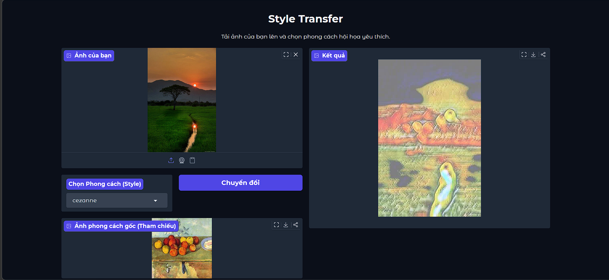
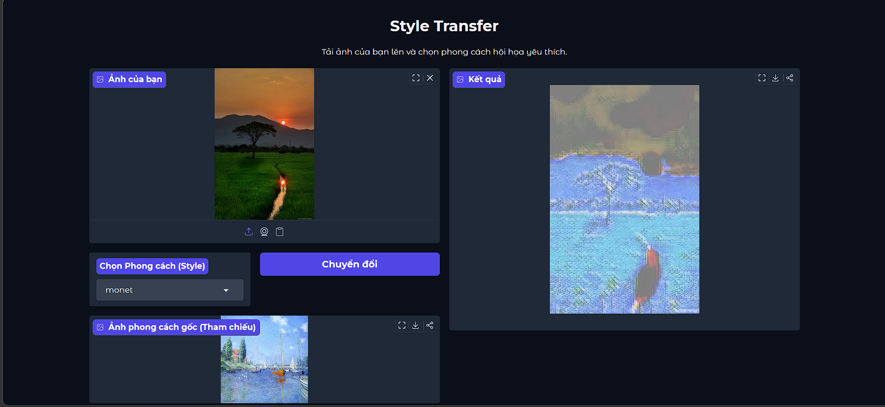
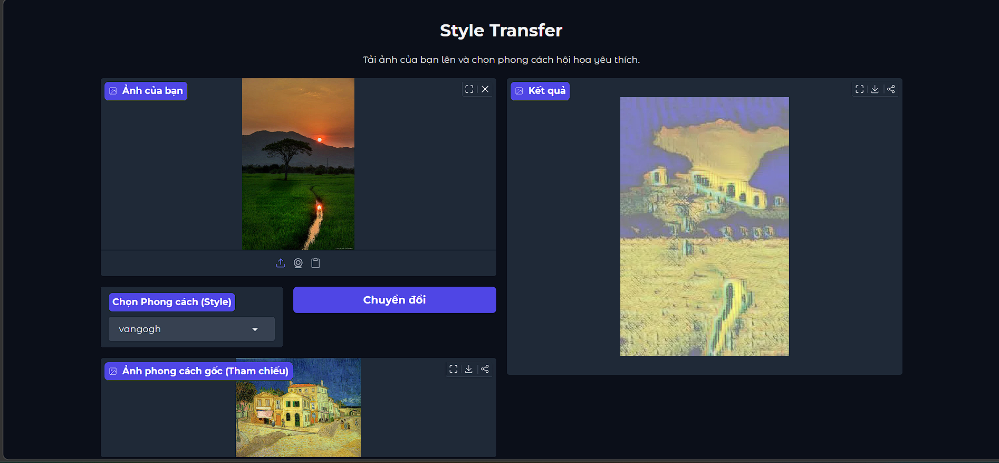

# Perceptual Style Transfer

An Deep Learning project that applies famous artistic styles (Cézanne, Monet, Van Gogh) to ordinary images using a feed-forward TransformerNet (Perceptual Style Transfer). This project demonstrates a complete machine learning pipeline: from data preparation and model training using Convolutional Neural Networks (CNNs), to deploying a RESTful API backend, and building an interactive web interface.

## Features
- **Fast Neural Style Transfer:** Transforms images in real-time using a pre-trained feed-forward network.
- **Multiple Artistic Styles:** Supports 3 distinct styles: Cézanne, Monet, and Van Gogh.
- **Backend:** Powered by FastAPI
- **Frontend:** Web interface built with Gradio

## Tech Stack
- **Deep Learning Framework:** PyTorch, Torchvision
- **Computer Vision:** PIL
- **Backend API:** FastAPI, Uvicorn
- **Frontend / UI:** Gradio
- **Environment:** Jupyter Notebook, Python 3.12

## Setup & Installation

**1. Clone the repository and install dependencies:**

```bash
git clone [https://github.com/hn-minh/photos-to-paintings.git](https://github.com/hn-minh/photos-to-paintings.git)
cd photos-to-paintings
uv sync
```

**2. Prepare the Dataset:**
To train the models from scratch, you need to structure your dataset as follows:

  - Place your diverse set of content images inside the `data/content_imgs/` directory.
  - Place your reference style images exactly like this:
      - `data/style_imgs/cezanne.jpg`
      - `data/style_imgs/monet.jpg`
      - `data/style_imgs/vangogh.jpg`

## Usage

### Step 1: Train the Models

Open and run the `train-perceptual-transformernet.ipynb` notebook. The notebook will process the dataset and train the TransformerNet for each specific style.

Upon successful completion, the model weights will be automatically saved to the `output/checkpoints/` directory as `cezanne.pth`, `monet.pth`, and `vangogh.pth`. *(Note: Ensure you copy or link these `.pth` files to the `checkpoints/` folder expected by the API if your folder structure differs).*

### Step 2: Start the FastAPI Backend

Open a terminal and start the API server. This will load the PyTorch models into memory and expose the `/predict` endpoint.

```bash
uv run uvicorn api.main:app --reload
```

*The API will be available at `http://127.0.0.1:8000`. You can test it directly via Swagger UI at `http://127.0.0.1:8000/docs`.*

### Step 3: Launch the Web UI

Open a second terminal and start the Gradio frontend:

```bash
uv run app.py
```

*Access the web interface at `http://127.0.0.1:7860`. Upload your photo, select your desired artist, and see the magic happen\!*

## Results




